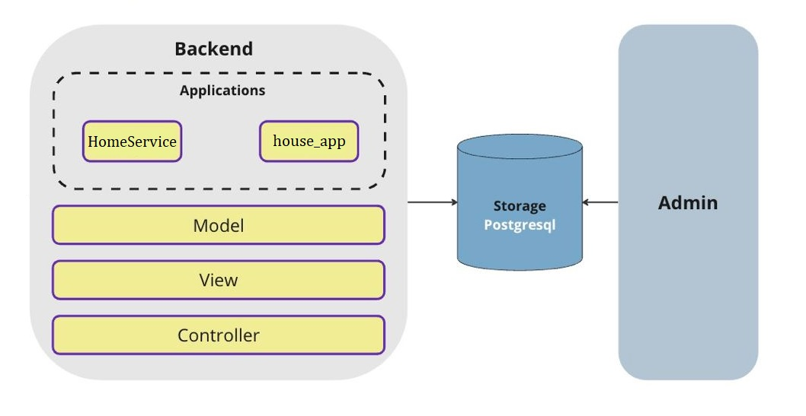

## Сервис для продажи и аренды недвижимости HomeService

На данный момент реализован следующий функционал:
- Ролевая модель доступа пользователей к сервису: различный функционал для клиентов и модераторов;
- Создание дома, добавление его в базу сервиса (для модераторов);
- Создание квартиры, связанной с домом (для всех авторизованных пользователей);
- Обновление/модификация данных о квартире (для модераторов);
- Получение списка доступных квартир для текущего дома (для всех авторизованных пользователей).


В разработке:
- Подписка на рассылку о новых объявлениях о недвижимости.


## Технологии
- `python3.12`
- пакеты из requirements.txt
- `docker` и `docker-compose`
- `PostgreSQL 15`

## Подготовка и запуск
- склонировать репозиторий
- в Вашей системе должны быть установлены все необходимые технологии из списка выше
- использовать команду `docker-compose up --build`

## Структура проекта
```
.
├── dummyenv/             # python venv
├── HomeService/          # core 
│   ├── __init__.py
│   ├── asgi.py
│   ├── settings.py
│   ├── urls.py
│   └── wsgi.py
├── house_app/            # logic
│   ├── __init__.py
│   ├── management/       # custom commands for manage.py
│   │   └── commands/
│   │       └── wait_for_db.py
│   ├── migrations/
│   ├── admin.py
│   ├── apps.py
│   ├── models.py
│   ├── serializers.py
│   ├── tests.py
│   ├── urls.py
│   └── views.py
├── manage.py
├── api.yaml
├── docker-compose.yml
├── Dockerfile
└── requirements.txt
```

## Логика


## API
- /api/v1/auth/register POST
- /api/v1/auth/login POST

- /api/v1/house/create POST
- /api/v1/house/{id} GET
- /api/v1/flat/create POST
- /api/v1/flat/update/{id} PATCH


## Примеры запросов и ответов:
<table style="width: 80%" >
<th></th>
<tr>
<td>
<pre>
<p>
curl --location '127.0.0.1:8000/api/v1/auth/register/' \
    --header 'Content-Type: application/json' \
    --data-raw '{
        "username": "vlad",
        "email": "vlad@example.com",
        "password": "vladpassword123",
        "user_type": "moderator"
    }'
</p>
</pre>
</td>
</tr>

<tr>
<td>
<pre>
<p>
curl --location '127.0.0.1:8000/api/v1/auth/login/' \
--header 'Content-Type: application/json' \
--data '{
    "username": "vlad",
    "password": "vladpassword123"
}'
</p>
</pre>
</td>
</tr>

<tr>
<td>
<pre>
<p>
curl --location '127.0.0.1:8000/api/v1/house/create/' \
--header 'Content-Type: application/json' \
--header 'Authorization: Bearer <...>' \
--data '{
    "house_number": "123",
    "address": "ул. Примерная, 150",
    "build_year": 2020,
    "developer": "ГК ПИК"
}'
</p>
</pre>
</td>
</tr>
</table>